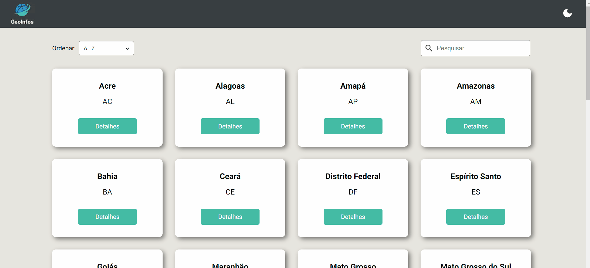

<div align="center">
  
</div>
<h1 align="center">Geo Infos</h1>

<p align="center">
  Este projeto é um site que exibe todos os estados do Brasil e todo os municípios do Estado escolhido.
</p>

<p align="center">
    <a href="#features">Features</a> &nbsp;&nbsp;•&nbsp;&nbsp;
    <a href="#tecnologias">Tecnologias</a> &nbsp;&nbsp;•&nbsp;&nbsp;
    <a href="#pré-requisitos">Pré-requisitos</a> &nbsp;&nbsp;•&nbsp;&nbsp;
    <a href="#rodando-o-front-end">Rodar a aplicação</a>
</p>

---

<br><br>

<div align="center">
    
    <br><br>
    
    <br><br>
    
</div>

<br><br>

## Features

- [x] Troca de temas
- [x] O tema é mantido
- [x] Consumo da API de Estados e cidades brasileiras
- [x] Exibe informações sobre todos os Estados brasileiros
- [x] Exibe o nome de todas as cidades do Estado escolhido
- [x] Barra de progresso enquanto carrega as requisições
- [x] Skeleton
- [x] Barra de pesquisa
- [x] Barra de filtragem
- [x] Página 404

<br>

## Tecnologias

Para o desenvolvimento deste projeto foram utilizadas as seguintes tecnologias:

- [React](https://reactjs.org/)
- [Next](https://nextjs.org/)
- [Context API](https://react.dev/reference/react/useContext)
- [API de Estados e municípios](https://brasilapi.com.br/)
- [API com número de habitantes dos Estados](https://www.geonames.org/)
- [Material UI](https://mui.com/)
- [Styled Components](https://styled-components.com/)
- [Nextjs progressbar](https://github.com/apal21/nextjs-progressbar)
- [Polished](https://polished.js.org/)
- [Jest](https://jestjs.io/pt-BR/)
- [Testing Library](https://testing-library.com/)
- [ESLint](https://eslint.org/)
- [Prettier](https://prettier.io/)
- [EditorConfig](https://prettier.io/)

<br>

## Pré-requisitos

Para rodar esse projeto na sua máquina, você precisará instalar as seguintes ferramentas: [Git](https://git-scm.com), [Node.js](https://nodejs.org/en/).

O editor de código recomendado é o [Visual Studio Code](https://code.visualstudio.com/)

<br>

## Rodando o Front-End

```bash
# Clone este repositório
$ git clone https://github.com/NatanTeixeiraVieira/geo_infos
# Acesse a pasta do projeto
$ cd geo_infos
# Instale as dependências
$ npm install
# Execute a aplicação em modo de desenvolvimento
$ npm run dev
```

<br>

---

<br>

Made with ❤️ by Natãn Teixeira Vieira
